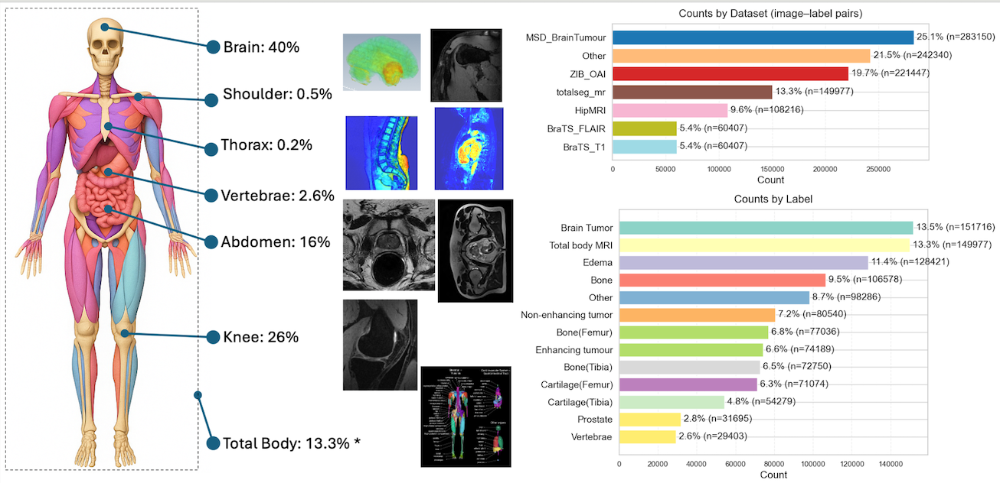

# 🧠 SAMRI: Segment Anything Model for MRI

**SAMRI** is an MRI-specialized adaptation of [Meta AI’s Segment Anything Model (SAM)](https://segment-anything.com/), designed for accurate and efficient segmentation across diverse MRI datasets.  
By fine-tuning only the **lightweight mask decoder** on **precomputed MRI embeddings**, SAMRI achieves state-of-the-art Dice and boundary accuracy while drastically reducing computational cost.

---

## 🌟 Highlights

- 🧩 **Decoder-only fine-tuning** — freeze SAM’s heavy image encoder and prompt encoder.  
- ⚙️ **Two-stage pipeline** — precompute embeddings → fine-tune decoder.  
- 🧠 **1.1 M MRI pairs** from **36 datasets / 47 tasks** across **10+ MRI protocols**.  
- 🚀 **94% shorter training time** and **96% fewer trainable parameters** than full SAM retraining.  
- 📈 **Superior segmentation** on small and medium structures, with strong zero-shot generalization.  
- 🖼️ Supports **box, point, and box + point prompts**.  

---

  
*Figure 1. Overview of SAMRI: efficient two-stage training. Stage 1: precompute and store image embeddings with the frozen SAM encoder, removing redundant per-epoch computation. Stage 2: fine-tune only the lightweight mask decoder while keeping the image and prompt encoders frozen—dramatically reducing compute and memory cost..*

---

## 🧭 Overview

**SAMRI** adapts SAM for the MRI domain by leveraging SAM’s strong visual representations while tailoring the decoder to medical structures and contrasts.  
The approach:
1. **Precomputes embeddings** using SAM ViT-B encoder on 2D MRI slices.  
2. **Fine-tunes only the mask decoder** with a hybrid focal–Dice loss for domain adaptation.  

This lightweight strategy allows SAMRI to train efficiently on a **single GPU** or **multi-GPU clusters** (e.g., H100 x 8), while maintaining robust accuracy across unseen datasets and imaging protocols.

---
## 🛠️ Installation

This section helps you go from **zero to a runnable environment** for SAMRI. It includes optional prerequisites, a reproducible Conda setup, and a brief explanation of how dependency installation works.


### 1️⃣ Prerequisites (Optional but recommended)
SAMRI requires **Python ≥ 3.10** and **PyTorch ≥ 2.2** (CUDA or ROCm recommended).  
Use a package manager like **Conda** to isolate dependencies per project.

- Download [**Anaconda** :arrow_upper_right:](https://www.anaconda.com/download)
- Download [**Miniconda (lightweight)** :arrow_upper_right:](https://docs.conda.io/en/latest/miniconda.html)


Verify Conda is available in command line:
```bash
conda --version
```

### 2️⃣ Create and activate a fresh environment
If you already have a base environment:

```bash
conda create -n samri python=3.10 -y
conda activate samri
```

### 3️⃣ Install PyTorch

Please install the correct [PyTorch :arrow_upper_right:](https://pytorch.org) version according to your operating system, package manager, language, and compute platform.
**Note:** This project has been verified on **PyTorch 2.2.0.**

### 4️⃣ Clone the Repository and install dependencies
```bash
git clone https://github.com/wangzhaomxy/SAMRI.git
cd SAMRI
pip install .
```

### 5️⃣ Verify Setup
Run a quick import test in the command line:
```bash
python -c "import torch, nibabel; print('SAMRI environment ready! Torch:', torch.__version__)"
```

If it prints without errors, your environment is correctly configured.

---
## 🚀 Quick Start (Inference & Visualization only)

This project ships two entry points for running SAMRI on your data:

| Mode | File | Description |
|------|------|-------------|
| **CLI** | `inference.py` | Fast segmentation from the command line. |
| **Notebook** | `infer_step_by_step.ipynb` | Interactive visualization for detailed inspection. |

The pretrained **SAMRI checkpoint** can be downloaded [**HERE** :arrow_upper_right:](https://espace.library.uq.edu.au/view/UQ:cadac84).
| Model  | Checkpoint  | Description |
|------|------|-------------|
| **SAMRI(box)**| samri_vitb_box.pth| SAMRI checkpoint with box prompt (Easy to go)|
| **SAMRI(box)**| samri_vitb_box_zero.pth | Zero-shot enhanced SAMRI checkpoint with box prompt (Easy to go)|
| **SAMRI(box+point)**| samri_vitb_bp.pth| SAMRI checkpoint with box + point prompt (Robust higher accuracy)|
| **SAMRI(box+point)**| samri_vitb_bp_zero.pth| Zero-shot enhanced SAMRI checkpoint with box + point prompt (Robust higher accuracy) |
| **SAM Vitb**| [sam_vit_b_01ec64.pth](https://dl.fbaipublicfiles.com/segment_anything/sam_vit_b_01ec64.pth) | SAM vitb checkpoint from [**GitHub**](https://github.com/facebookresearch/segment-anything).|
| **SAM Vith**| [sam_vit_h_4b8939.pth](https://dl.fbaipublicfiles.com/segment_anything/sam_vit_h_4b8939.pth) | SAM vith checkpoint from [**GitHub**](https://github.com/facebookresearch/segment-anything).|
| **MedSAM**| [medsam_vit_b.pth](https://drive.google.com/drive/folders/1ETWmi4AiniJeWOt6HAsYgTjYv_fkgzoN?usp=drive_link) | MedSAM checkpoint from [**GitHub**](https://github.com/bowang-lab/MedSAM).|

Once the checkpoints are downloaded, place them in the **/user_data/pretrained_ckpt/** directory.

### 1️⃣ Inference (CLI) — `inference.py`

Run SAM/SAMRI on a single NIfTI (`.nii/.nii.gz`) **or** standard image (`.png/.jpg/.tif`) and save the predicted mask.

**Basic usage**
```bash
python inference.py \
  --input ./user_data/Datasets/demoSample/example_img_1.nii.gz \
  --output ./user_data/Datasets/infer_output \
  --checkpoint ./user_data/pretrained_ckpt/samri_vitb_bp.pth \
  --model-type samri \
  --device cuda \
  --box X1 Y1 X2 Y2\
  --point X Y \
  --no-png True
```
<details>

<summary><b>🧠 For Apple silicon</b></summary>

```bash
python inference.py \
  --input ./user_data/Datasets/demoSample/example_img_1.nii.gz \
  --output ./user_data/Datasets/infer_output \
  --checkpoint ./user_data/pretrained_ckpt/samri_vitb_bp.pth \
  --model-type samri \
  --device mps \
  --box X1 Y1 X2 Y2\
  --point X Y \
  --no-png True
```
</details>
<br>

**CLI arguments (from `inference.py`)**
- `--input, -i` (required): path to `.nii/.nii.gz` **or** `.png/.jpg/.tif`
- `--output, -o` (required): output folder where results are written
- `--checkpoint, -c` (required): path to SAM/SAMRI checkpoint (`.pth`)
- `--model-type` (default: `vit_b`): one of `vit_b | vit_h | samri` (`samri` maps to ViT-B backbone)
- `--device` (default: `cuda`): e.g., `cuda`, `cpu` (or `mps` on Apple Silicon if available)
- `--box X1 Y1 X2 Y2` (required): bounding box prompt (pixels)
- `--point X Y` (optional): foreground point prompt (pixels)
- `--no-png` (flag): if set, do **not** save PNG; only `.nii.gz` mask is written. If you want save PNG, delete this line.

**Outputs**
- `<case>_seg_.nii.gz` — predicted mask saved as NIfTI with shape `[1, H, W]`
- `<case>_seg_.png` — (unless `--no-png`) grayscale binary mask PNG. 

**Example**
```bash
python inference.py \
  --input ./user_data/Datasets/demoSample/example_img_1.nii.gz \
  --output ./user_data/Datasets/infer_output \
  --checkpoint ./user_data/pretrained_ckpt/samri_vitb_bp.pth \
  --model-type samri \
  --device cuda \
  --box 115 130 178 179\
  --point 133 172
```
<details>
<summary><b>🧠 For Apple silicon</b></summary>

```bash
python inference.py \
  --input ./user_data/Datasets/demoSample/example_img_1.nii.gz \
  --output ./user_data/Datasets/infer_output \
  --checkpoint ./user_data/pretrained_ckpt/samri_vitb_bp.pth \
  --model-type samri \
  --device mps \
  --box 115 130 178 179\
  --point 133 172
```
</details>
<br>

> ⚠️ **Note:**
> - The input must be a 2D image. 
> - It is automatically normalized to 8-bit and converted to RGB to align with SAM’s internal preprocessing. 
> - The expected NIfTI file shape is (1, H, W) or (H, W), with (H, W, 1) also supported via automatic squeezing. 
> - The image input accepts dimensions in any of the following forms: H×W, H×W×1, H×W×3, or H×W×4.


### 2️⃣ Visualize step-by-step (Notebook) — `infer_step_by_step.ipynb`

Use the notebook to experiment with prompts and visualize each stage.

**Open** `./infer_step_by_step.ipynb` and set the cell parameters:
```python
# --- User configuration ---
INPUT_PATH = "/path/to/your/input.nii.gz"   # or .png/.jpg
OUTPUT_DIR = "./Notebook_Visualization"
CHECKPOINT = "./checkpoints/samri_decoder.pth"  # SAM / SAMRI checkpoint
MODEL_TYPE = "samri"  # 'vit_b' | 'vit_h' | 'samri'
DEVICE = "cuda"       # 'cuda' | 'cpu' | 'mps'

# Optional prompts (pixel coords)
BOX = [30, 40, 200, 220]   # or None
POINT = [120, 140]         # or None
SAVE_PNG = True            # also write PNG next to the NIfTI
```

**Then run cells** to:
1. Load & normalize the input (NIfTI or image)
2. Configure optional **box/point** prompts
3. Run SAMRI inference
4. Save: `<name>_seg_.nii.gz` (+ optional `<name>_seg_.png`)
5. Display publication-friendly overlays/contours inside the notebook

> The notebook uses the same image preparation and I/O utilities as the CLI, ensuring identical masks for matching inputs and prompts.
---
## 🧑‍🏫 Training the Model

This section covers **end‑to‑end training** of SAMRI’s decoder on precomputed SAM embeddings. The workflow is lightweight:
1) **Prepare data** → 2) **Precompute embeddings** → 3) **Train decoder**.

> SAMRI freezes SAM’s image encoder and fine‑tunes only the **mask decoder** using a Dice+Focal loss.


### 1️⃣ Prepare Your Data

**Download & Organize Raw MRI Data**
Download the raw MRI datasets and organize them according to the specifications outlined in the RawData section.
Verify that all files are correctly structured and complete before initiating the preprocessing step.
<details>
<summary><b>🧠 Click and see the Raw Datasets structure</b></summary>

```bash
📂 Datasets/
├── ACDC/
├── Brain_Tumor_Dataset_Figshare/
├── Brain-TR-GammaKnife-processed/
├── CC-Tumor-Heterogeneity/
├── CHAOS/
├── HipMRI/
├── ISLES-2022/
├── Meningioma-SEG-CLASS/
├── MSD/
├── MSK_knee/
├── MSK_shoulder/
├── NCI-ISBI/
├── Npz_dataset/
│   ├── AMOSMR/
│   ├── BraTS_FLAIR/
│   ├── BraTS_T1/
│   ├── BraTS_T1CE/
│   ├── CervicalCancer/
│   ├── crossmoda/
│   ├── Heart/
│   ├── ISLES2022_ADC/
│   ├── ISLES2022_DWI/
│   ├── ProstateADC/
│   ├── ProstateT2/
│   ├── QIN-PROSTATE-Lesion/
│   ├── QIN-PROSTATE-Prostate/
│   ├── SpineMR/
│   ├── totalseg_mr/
│   ├── WMH_FLAIR/
│   └── WMH_T1/
├── OAI_imorphics_dess_sag/
├── OAI_imorphics_flash_cor/
├── OAI_imorphics_tse_sag/
├── OAIAKOA/
├── Picai/
├── PROMISE/
├── QIN-PROSTATE-Repeatability/
├── QUBIQ/
├── Spine/
└── ZIB_OAI/

Link is processing...
```
</details>


**Run the Preprocessing Script**
Run the following command to preprocess and save the datasets:
```bash
python image_processing.data_processing_code.data_processing \
  --dataset-path /path/to/your/target-dataset \
  --save-path /path/to/your/target-save-directory
```
>⚠️ Note: The raw data may be periodically updated by the dataset authors. If error occur, please modify the corresponding scripts under `./image_processing/data_processing_code/` to maintain compatibility folder.

**Preparing Your Own Data**
To apply SAMRI to your own MRI data, follow the recommended workflow below:
* Patient-wise splitting: Divide the dataset into training, validation, and testing subsets.
* Slice generation: Convert each 3D MRI volume into a series of 2D slices.
* Quality filtering: Retain only slices with a mask pixel count greater than 10. (To avoid main noise.)
* Noise removal: Manually inspect and remove noisy or corrupted image–mask pairs (e.g., thin lines or artifacts).
* Data organization: Save the cleaned data in a well-structured directory format (e.g., training/, validation/, testing/).

Organize datasets into separate folders with patient-wise splits for training, validation, and testing.
Place each image and its corresponding mask within the same directory.
Examples:
```
./user_data/Datasets/SAMRI_train_test
├── dataset_A/
│   ├── training/
│   │   ├──example1*_img_*.nii.gz
│   │   ├──example1*_seg_*.nii.gz    # matching file names (binary/label masks)
│   │   └──...
│   ├── validation/         # .nii.gz
│   │   └──...
│   └── testing/
│   │   └──...          
├── dataset_B/
│   ├── training/
│   ├── validation/         # .nii.gz
│   └── testing/   
└── ...
```

> * Masks should align with images in shape and orientation. 
> * For 3D NIfTI, training is typically on **2D slices**.
> * The image and mask files should be organized in the same folder with different keys: **"\_img_\"** for images, and **"\_seg_\"** for masks, respectively. Other part of the name should be the same or in the same order after being sorted.
> * The shape of the image and mask are both 1 x H x W.


### 2️⃣ Precompute Image Embeddings
Use the SAM ViT-B model to compute and cache image embeddings, thereby reducing training time and memory consumption.

```bash
python preprocess.precompute_embeddings \
  --base-path ./user_data \
  --dataset-path ./user_data/Datasets/SAMRI_train_test/ \
  --img-sub-path train/ \
  --save-path ./user_data/Datasets/Embedding_train/ \
  --checkpoint ./user_data/pretrained_ckpt/sam_vit_b_01ec64.pth \
  --device cuda
```
**Key args**
- `--base-path` : Root folder of the user data
- `--dataset-path` : Dataset directory.
- `--img-sub-path` : Dataset subfolder, choose from "train", "validation", and "test".
- `--save-path` : Embedding save directory.
- `--checkpoint` : The path of the SAM Vitb checkpoint.
- `--device` : Computation device, choose from "cuda", "cpu", and "mps".

> The computed embeddings are saved in a **.npz** file containing the following keys:
> * **img**: the image embedding
> * **mask**: the corresponding segmentation mask
> * **ori_size**: the original height and width of the image and mask.


### 3️⃣ Train the Decoder

#### Single‑GPU
SAMRI can be trained on commercial GPUs. The following example command illustrates this setup.
Some HPC systems also provide interactive GPU terminals for direct command-line execution.
```bash
python train_single_gpu.py \
  --model_type samri \
  --batch_size 48 \
  --data_path ./user_data \
  --model_save_path ./user_data/Model_save \
  --num-epochs 120 \
  --device cuda \
  --save-every 2 \
  --prompts mixed \
```

#### Multi‑GPU (same node, PyTorch DDP)
Some HPC systems provide command-line access for multi-GPU training. The following command can be used in such cases and can also be included in a SLURM script for batch execution.
```bash
python train_multi_gpus.py \
  --model_type samri \
  --batch_size 48 \
  --data_path ./user_data \
  --model_save_path ./user_data/Model_save \
  --num-epochs 120 \
  --save-every 2 \
  --prompts mixed \
```
>**Common args for training scripts:**
>- `--model_type samri` : the training model type.
>- `--batch_size` : per‑process batch size (effective = batch_size × world_size) Mi300X(192G)=1024, A/H100(80G)=512. Lower batch size if OOM occurs.
>- `--data_path ./user_data` : The training embedding folder path.
>- `--model_save_path ./user_data/Model_save` : where to write checkpoints (`.pth`)
>- `--num-epochs` : number of training epochs. 
>- `--device` : The model training GPU. Choose from "cuda" and "mps".
>- `--save-every` : save checkpoints every x epoch.
>- `--prompts mixed` : training prompts. Choose from "point", "bbox", and "mixed", where "mixed" means point+bbox prompt.

#### SLURM 
SLURM scripts are commonly used for job submission in HPC environments. The provided example can be found at `./train_multi_gpus_mi300.sh`. Modify the configuration as needed to suit your specific HPC setup.

Examples:
```bash
#!/bin/bash --login
#SBATCH --nodes=1
#SBATCH --ntasks-per-node=1
#SBATCH --cpus-per-task=64
#SBATCH --mem=1T
#SBATCH --job-name=SAMRI
#SBATCH --time=7-00:00:00
#SBATCH --partition=gpu_rocm
#SBATCH --gres=gpu:mi300x:8
#SBATCH --account=xxxxx   # Use your account if available.
#SBATCH --qos=sdf
#SBATCH -o /home/Documents/slurm-%j.output #The path to save output logs.
#SBATCH -e /home/Documents/slurm-%j.error #The path to save processing logs.
#SBATCH --mail-type=ALL
#SBATCH --mail-user=your_email@email.com

module load anaconda3
source $EBROOTANACONDA3/etc/profile.d/conda.sh
conda activate samri-mi300

# Dynamically assign port from job ID to avoid collisions
export MASTER_ADDR=localhost
export MASTER_PORT=$((26000 + RANDOM % 1000))  # Pick a port between 26000 ~ 26999

python train_multi_gpus.py
```


#### 🧯 Troubleshooting
- **CUDA/ROCm OOM**: lower `--batch_size`; reduce `num_workers`;
- **Slow data loading**: set `--num_workers 8..12`
- **Validation mismatch**: confirm same preprocessing/normalization as training


#### 🔎 Notes on Backends
- **PyTorch/CUDA**: install a build matching your CUDA version
- **ROCm (AMD MI300X/MI210)**: use ROCm PyTorch wheels; NCCL flags above may help
- **Apple Silicon (MPS)**: training is possible, but performance is limited compared to CUDA/ROCm

---

## 📊 Model Evaluation

This section outlines the procedures for validating, testing, and visualizing model performance across the validation and test datasets.
Models are evaluated using the following metrics:
- **Dice Similarity Coefficient (DSC)**  
- **Hausdorff Distance (HD)**  
- **Mean Surface Distance (MSD)**  

Dedicated evaluation scripts are also provided for **SAM**, **SAMRI**, and **MedSAM** models.


### **1️⃣ Validate the Model on Validation Datasets**

This step evaluates model performance on **precomputed embeddings** rather than raw images.  
It is efficient for internal validation because embeddings are already generated during preprocessing.

**Script:** `./evaluation/val_in_batch.py`

```bash
python evaluation.val_in_batch.py \
    --val-emb-path /path/to/val/embeddings/ \
    --ckpt-path /path/to/checkpoint_directory/ \
    --prompts mixed \
    --device cuda \
    --batch-size 64
```

> ⚠️**Notes:**
> - The script loads embeddings directly from `.npz` files and runs **batch evaluation**.
> - This avoids redundant image encoding and greatly speeds up the validation process.
> - Use this to measure **training progress** or perform **hyperparameter tuning**.
> - The results will be saved in a CSV file under the checkpoint directory.


### **2️⃣ Test the Model on Test Datasets**

This evaluates the model directly on the **test images** (not precomputed embeddings).  
Two common use cases are supported:

#### 🧩 Evaluate a Single Checkpoint
Use a specific checkpoint file for testing:
```bash
  python evaluation.test_vis.py \
    --test-image-path /path/to/test/images/ \
    --ckpt-path /path/to/checkpoint.pth \
    --save-path /path/to/save/results/ \
    --device cuda \
    --model-type samri
```

#### 📁 Evaluate Multiple Checkpoints under a Folder
Automatically evaluate all `.pth` files in a directory:
```bash
  python evaluation.test_vis.py \
    --test-image-path /path/to/test/images/ \
    --ckpt-path /path/to/checkpoint_directory/
    --save-path /path/to/save/results/ \
    --device cuda \
    --model-type samri
```

**Features:**
- Supports both **SAM** and **SAMRI** models.
- The script automatically detects single-file or multi-checkpoint folders.
- Evaluates each checkpoint and saves detailed metrics and predictions in a python pickle binary file.

> ⚠️ **Note: MedSAM** uses a distinct preprocessing and inference pipeline (see below).

### **3️⃣ Other Models — MedSAM Evaluation**

Two dedicated scripts are provided to ensure **MedSAM** compatibility.

#### a. `test_medsam.py`
Runs inference using the **original MedSAM architecture** (from its official repository)  
with added dataset loading and result-saving features.

```bash
  python evaluation.test_medsam.py \
  --test-image-path /path/to/test/images/ \
  --ckpt-path /path/to/checkpoint.pth \
  --save-path /path/to/save/results/ \
  --device cuda
```

- Each case is saved as an `.npz` file containing both the **ground truth mask** and **predicted mask**.  
- Useful for comparing outputs across architectures.

#### b. `test_medsam_eval.py`
Processes the `.npz` results produced above and computes evaluation metrics:
```bash
  python evaluation.test_medsam_eval.py \
  --medsam-infer-path /path/to/medsam/inference/results/ \
  --save-path /path/to/save/evaluation/results/
```

- Aggregates and reports **Dice**, **IoU**, and **boundary metrics**.
- Produces results in the same standardized format as SAMRI evaluations.

### **4️⃣ Visualize Testing Results**

Use the provided Jupyter notebook to **visualize** and **compare** results interactively:

**Notebook:** `/evaluation/result_visualize_and_evaluate.ipynb`

Open it and set the directories where your `.npz` result files were saved:
```python
result_root = "/the/directory/of/the/evaluation/results/Eval_results/"
```

You can:
- Compare performance between **SAM**, **SAMRI**, and **MedSAM**
- Generate summary plots (Dice boxplots, etc.)

---

## 🧠 Dataset Overview

SAMRI is trained on a curated **1.1 million MRI image–mask pairs** from **36 public datasets** (47 segmentation tasks) spanning over **10 MRI sequences** (T1, T2, FLAIR, DESS, TSE, etc.).

| Category | Example Datasets | Approx. Pairs |
|-----------|------------------|---------------|
| **Brain** | BraTS, ISLES, | 440 K |
| **Knee** | MSK_T2, OAI,  | 286 K |
| **Abdomen** | AMOSMR, HipMRI | 176 K |
| **Total Body** | Totalseg MR | 143 K |
| **Others** | Prostate, MSD_kidney | 55 K |

Detailed dataset breakdowns are provided in **Table S1 (Supplementary)** in the paper.

 
*Figure 2. Datasets: anatomical coverage of the 1.1 million MRI image–mask pairs used to train SAMRI, summarized by body region (Brain 40%, Knee 26%, Abdomen 16%, Vertebrae 2.6%, Shoulder 0.5%, Thorax 0.2%, and a Whole-body/“Total Body” set 13.3%*).*

---

## 📁 Repository Structure

The **SAMRI** repository is organized into modular components for preprocessing, training, evaluation, and utility functions.  
Below is an overview of the folder hierarchy and their main purposes:
```bash

SAMRI/
├── evaluation/           # Evaluation and visualization scripts
├── image_processing/     # Data preprocessing & embedding generation
├── segment_anything/     # SAM backbone integration
├── utils/                # Dataloaders, losses, utilities
├── inference.py          # CLI inference entry
├── infer_step_by_step.ipynb
├── train_single_gpu.py
├── train_multi_gpus.py
├── train_multi_gpus_mi300.sh
├── model.py
├── setup.py
└── README.md
```
<details>
<summary><b>Click and see the Repository Structure Details</b></summary>

```
SAMRI/
├── evaluation/                         # Model evaluation and visualization scripts
│   ├── MedSAM-main/                    # External MedSAM main code
│   ├── result_visualize_and_evaluate.ipynb   # Visualization and comparative analysis notebook
│   ├── test_medsam.py                  # Run MedSAM inference and save predictions
│   ├── test_medsam_eval.py             # Evaluate MedSAM inference results (.npz files)
│   ├── test_vis.py                     # Evaluate SAM/SAMRI models on test datasets
│   ├── val_in_batch.py                 # Batch validation using precomputed embeddings
│   └── utils.py                        # Shared helper functions for result_visualize_and_evaluate.ipynb
│
├── image_processing/                   # Data preprocessing and embedding generation
│   ├── data_processing_code/           # Individual dataset preprocessing scripts
│   └── process_embedding.py            # Generate image embeddings for SAMRI
│
├── segment_anything/                   # SAM model integration
│   └── ...                             # (Meta-AI SAM model components)
│
├── user_data/                          # (Optional) Placeholder for user data or experiments
│
├── utils/                              # Core utilities shared across training/inference
│   ├── dataloader.py                   # Dataset loading and management
│   ├── losses.py                       # Custom loss functions (e.g., Dice + Focal)
│   ├── utils.py                        # Configuration, device setup, and helper methods
│   └──visual.py                        # Visualization utilities
│
├── infer_step_by_step.ipynb            # Interactive notebook for step-by-step inference
├── inference.py                        # Command-line inference script
├── model.py                            # SAMRI model definition
├── sarmi_gui(BugWarning).py            # GUI version (experimental)
│
├── train_single_gpu.py                 # Training script for single-GPU setups
├── train_multi_gpus.py                 # Training script for multi-GPU (DDP)
├── train_multi_gpus_mi300.sh           # SLURM submission script for MI300X cluster
│
├── setup.py                            # Installation and environment setup
├── LICENSE                             # License file
└── README.md                           # Main documentation file
```

</details>


---
## 📘 Citation

If you use SAMRI in your research, please cite:

content is on the way...

<!-- ```bibtex
@article{
}
``` -->

---

## 📄 License

This repository is released under the **Apache 2.0 License** (or specify otherwise).  
See the [LICENSE](LICENSE) file for details.

---
## 🤝 Acknowledgments

Developed at **The University of Queensland (UQ)**,  
**School of Electrical Engineering and Computer Science (EECS)**.

Special thanks to the **Bunya HPC Team** for infrastructure support.

Built upon **Meta AI’s Segment Anything Model (SAM)**, and inspired by the broader community efforts to adapt SAM to medical imaging.  

We also gratefully acknowledge the **MedSAM team** for pioneering open-source adaptations of SAM for medical images and for releasing code/weights that served as an important baseline and point of comparison.

We thank open-source contributors and the MRI research community for dataset availability.

---

## 📬 Contact

**Zhao Wang**  
School of Electrical Engineering and Computer Science (EECS)  
The University of Queensland, Australia  
📧 zhao.wang1@uq.edu.au

**Shekhar “Shakes” Chandra**
ARC Future Fellow & Senior Lecturer
School of Electrical Engineering and Computer Science (EECS)  
The University of Queensland, Australia  
📧 shekhar.chandra@uq.edu.au


